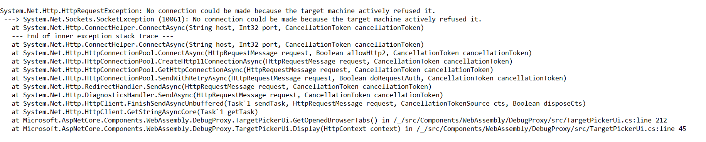

Blazor Multi Server Readme

Stewart Hyde

Introduction
============

This is basically a test application which I created because of problems I
notice with Blazor Webassembly. The initial plan was to have Webassembly ASP.Net
core logic call and another server which would be consider the master for some
specific information. But I decided to make a test application and to explored
creating an additional second ASP.Net Core server but while working I wonder if
the client could cause two servers.

Steps I use to create the project
=================================

1.  Build Sample Blazor WebAssembly App with ASP.Core Hoot on

2.  Add simple API request and page for testing purposes

3.  Clone Server component for new Server with different ports

4.  Update clone so it is different and update client to call it

5.  Separate the Passthrough server calls from Client calls because of client
    issue

6.  Add External Json API as part of the test for Passthrough

Technical Issue with Calling another Service though client
==========================================================

There is a technical issue with connection gets refused with when calling a
separate Json service from the client. The connection gets refused. This is with
same code that sits in Shared folder. This code works successfully from ASP.Net
Core logic which is what I refer to Passthrough which was original plan. This
works with both 2nd clone ASP.Net Core server and external JSON API. The simple
API server request is design just to return status message in the process. This
simple API server is part of clone ASP.Net Core. I create a Stack overflow
question concerning this problem

<https://stackoverflow.com/questions/62313078/httpclientfactory-and-webassembly-net-core-hosted-crashes-on-on-client>

The simple way to recreate this is issue is created with a Blazor Webassembly
App and make sure that ASP.NET Core Hosted option is selected. Once the project
is created, create a page in client that that shows json from any external json
API. Note this works fine in the ASP.NET Core controller.

My thought it something to do with Webassembly code where it only allows one
connection to ASP.NET Core Host.

I have updated the project to include other tests related to issue with Client.
First of all it important to note that that this is being call from Webassembly
client – in Client folder and not from the Server fold which works find.

I had direct calls the same external Weather service which work fine from the
Web server. But I also thought that I could possibly make a Javascript call to
get the Json data from the site but even a simple Javascript experience the same
problem

The following is output generated on the client when the error happens.
Unfortunately, I only have 2019 Community Edition and can not use Intellitrace
which may help.

This is some that might be not possible with Webassembly, not sure how important
it actually is to be able to call other javascript or other services from actual
client code.
